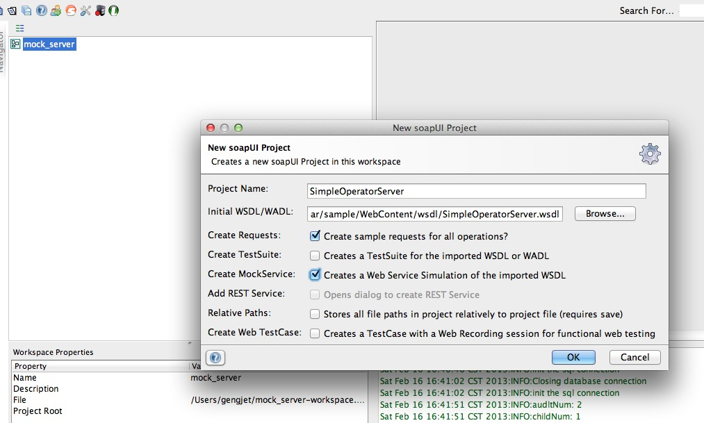
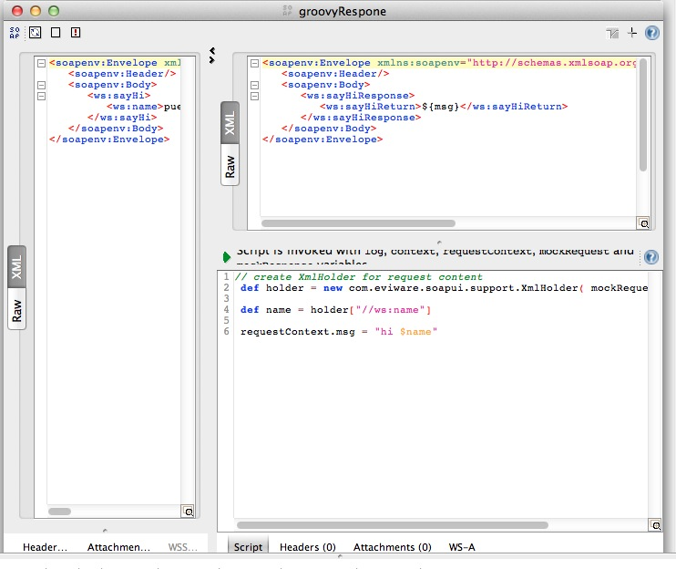

用SoapUI mock Web服务
======================
最近工作大量使用三方的Web Service（以下简称WS）。三方的WS时好时坏。让人很是郁闷，所以就动了自己按照三方提供的wsdl自己实现同样接口的WS。其实这就是Mock。 简单google了一下发现 `SoapUI <http://www.soapui.org/Service-Mocking/creating-dynamic-mockservices.html>`_ 已经具有这样的功能，而且很容易上手。毫不犹豫的用起来。

创建动态的WS mock
------------------------

我们的目标是根据一个wsdl文件创建一个WS mock。WS client可以方法这个WS mock，并且能产生动态的相应。
在开始前我们需要如下材料：

 #. JDK， 建议使用1.5向上版本。
 #. SoapUI 4.5.1版本
 #. 一个wsdl文件。我使用的wsdl文件在

好了，准备好上述的内容我们就开始创建WS mock。
首先打开SoapUI。 通过File菜单中的new project新建一个项目。

.. note::
    
    在创建界面要勾选"Create MockService"选项。

在SoapUI的导航面板中，我们就会看到如下图所示的结构

.. image:: ../../../static/images/soapui-mock.png

#. mock WS中显示了Mock WS的所有响应。当然你可以通过右键菜单对他做各种操作。
#. 通过右键菜单中的"Show MockService Editor"可以打开"服务器启动按钮"所在的"MockService Editor"。 
#. 点击"服务器启动按钮"时就会启动一个jetty（jetty-6.1.26）服务器，并将部署一个包括当前mock的服务到jetty中。这时通过浏览器访问 http://localhost:8088 就会看到如下效果。

.. image:: ../../../static/images/mock-server-infirefox.jpg

这时mock WS已经开始服务了。但是现在的mock还是静态的。SoapUI为了让用户创建动态的响应提供了Groovy脚本支持。
下面就来创建动态的响应。

通过Groovy脚本创建动态响应
^^^^^^^^^^^^^^^^^^^^^^^^^^^^^^^^

通过点击sayHi，下面的Response 1项的右键菜单中的"Show MockResponse Editor"打开"MockResponse Editor" 准备编辑该响应。
具体内容如下图所示：

下面分析图中的代码：

.. code-block:: groovy
   :linenos: 

    // create XmlHolder for request content
    def holder = new com.eviware.soapui.support.XmlHolder( mockRequest.requestContent )

    def name = holder["//ws:name"]

    requestContext.msg = "hi $name"

#. 第2行，将Soap 请求封装成一个XmlHolder。提供各种好用的东西，让你想取请求中的那个部分，就取那个部分。
#. 第3行，取出"//ws:name"。 也就是客户端传来的name参数。
#. 第6行，拼出一个动态的变量。存放到requestContext中。备用！
#. 最后在响应中以${msg}的方式引用存入requestContex中的msg变量。

由于这个Scrip 是用Groovy写的，你可以使用任何语句。完成你的逻辑。你甚至可以通过jdbc连接数据库。查询数据。
要完成jdbc连接数据库要解决如下问题：
 #. 如何为SoapUI中的Groovy脚本添加三方jar？
 #. 如何让多个响应公用一个数据库连接池？
 #. 随后为了能够脱离SoapUI进行测试，如何把我们创建好的Mock WS部署到类似于Tomcat， Jetty这样的服务器中去？

欲见详情，请听下回分解！

.. author:: Jet Geng 
.. categories:: WS 
.. tags:: Java Groovy
.. comments::
